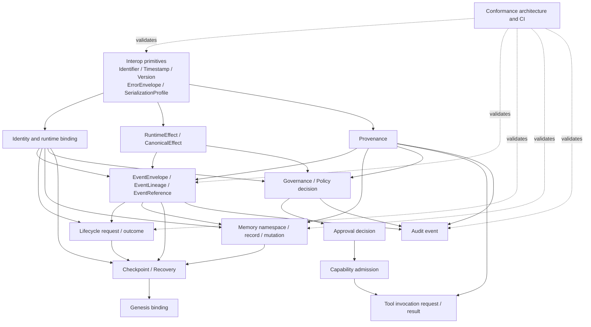

# AION Cross-Language Contract Surface Map v0.1.0

**Status:** `ESTABLISHED_CANDIDATE`

**Reviewed baseline:** `345eaf10e8ac3383ad3337f1fffcd940c612d867`

**Authorized work branch:** `engineering/aion-language-agnostic-runtime-integration-20260814`

**Canonical effect:** `NONE`

**Deployment:** `FALSE`

**Independent IV&V:** `NOT_ACHIEVED`

## 1. Purpose and authority boundary

This document is the durable topology for the AION system-wide language-agnostic / polyglot engineering program. It distinguishes semantic contracts from implementation mechanisms and records the current repository reality before additional contract families are implemented.

The map is an engineering candidate artifact. It does not establish canonical state, production authority, subjectivity, consciousness, personhood, identity continuity, or research conclusions. Caller-supplied labels do not grant authority. A contract family becomes an implementation requirement only when its ownership, authority, provenance, validation, compatibility, and conformance behavior are explicitly established.

The only write authority for this milestone is the authorized engineering branch. `main`, `review/four-domain-research-materialization`, and `cleanup/manus-output-consolidation-20260813` remain read-only and protected.

## 2. Current-reality summary

| Contract family | Current repository evidence | Current status | Principal gap |
|---|---|---:|---|
| Interoperability primitives | No shared AION primitive schemas; Python modules use local string, timestamp, JSON, and exception conventions | `PARTIAL` | Define Identifier, Timestamp, Version, ErrorEnvelope, and SerializationProfile once |
| Identity | `IndividualRuntimeContext` schema and Python parser; AION/Astra composition roots bind their own contexts | `ESTABLISHED_CANDIDATE` | Separate identifier syntax, identity binding, owner, runtime instance, and authority |
| Effects | `canonical_effect = NONE` appears throughout runtime, memory, checkpoint, audit, and approval artifacts | `PARTIAL` | Define RuntimeEffect separately from CanonicalEffect; prevent state references from implying write authority |
| Provenance | `schemas/provenance_record.schema.json` separates source class, attribution, derivation, approval, and canonical effect | `ESTABLISHED_CANDIDATE` | Map provenance to event, memory, approval, audit, and conformance outputs |
| Events | Individual runtime event table stores sequence, context, payload, predecessor hash, and event hash | `PARTIAL` | Define language-neutral EventEnvelope and exact ordering / digest semantics |
| Lineage | Individual runtime `verify()` checks sequence, predecessor hash, stable identity, and lifecycle validity | `PARTIAL` | Reconcile runtime lineage with the separate JSONL audit chain |
| Lifecycle | `LifecycleTransitionRequest`, `LifecycleTransitionOutcome`, request schema, and conformance vectors | `END_TO_END_CANDIDATE / PYTHON_REFERENCE` | Reuse the generic outcome semantics across implementations |
| Memory | `MemoryRecord`, namespace-bound recall, provenance gating, conflict, supersession, and tombstone flags | `PARTIAL` | Define MemoryNamespace, MemoryRecord, and mutation semantics independently of SQLite |
| Governance | Governance kernel and evidence-control tests exist; runtime policy is implemented in Python | `PARTIAL` | Define GovernanceDecision and PolicyDecision contract boundaries |
| Approval | Main-transition receipt schema and inspection-only validator; runtime checkpoint / rollback / migration require explicit approval | `PARTIAL` | Separate account evidence, human intent, scope, target, freshness, and non-inheritance |
| Capability | Task policy and network policy are implemented in executable runtime | `PARTIAL` | Define CapabilityAdmission; capability is not authority |
| Tools | Bounded execution engine has Action / Observation shapes and offline / loopback policy | `PARTIAL` | Define ToolInvocationRequest / Result without unrestricted tool authority |
| Checkpoint / recovery | Runtime checkpoint, recovery verification, and identity-preserving migration exist | `PARTIAL` | Define portable checkpoint ownership, version, integrity, and fail-closed recovery |
| Genesis | Runtime contexts carry `genesis_root_id`; repository has genesis-related research material | `PARTIAL` | Define only authorized identity/runtime/genesis relationships; no 3D or personhood claims |
| Audit | `AppendOnlyAudit` provides a second JSONL hash-chain implementation | `PARTIAL` | Reconcile audit envelope, canonical bytes, genesis predecessor, and error semantics |
| CI | Quality push triggers are `main`, `feat/**`, and `review/**`; Runtime Strong QA is PR/manual only | `GAP_CONFIRMED` | Add `engineering/**` push coverage without changing settings or protected branches |
| Non-Python implementation | No justified Rust, Go, or TypeScript implementation has been established | `NOT_STARTED` | Select one pilot only after primitives, vectors, and CI are stable |

## 3. Contract families and ownership map

| Domain | Candidate contract | Caller-controlled data | Derived / implementation-controlled data | Authority and ownership boundary | Dependencies |
|---|---|---|---|---|---|
| Interop | `Identifier` | Identifier value only | Normalization and validity result | Identifier appearance never grants authority | None |
| Interop | `Timestamp` | Timestamp text at an admission boundary | Parsed instant and canonical representation | No local-time inference | Identifier, SerializationProfile |
| Interop | `Version` | Schema / contract version | Compatibility classification | Unsupported incompatible versions fail closed | Identifier |
| Interop | `ErrorEnvelope` | Bounded error details where permitted | Error code, category, retryability, mutation result | Exception class is not external semantics | Version, CanonicalEffect |
| Interop | `SerializationProfile` | Contract object | Canonical bytes and rejection result | No language serializer silently defines AION semantics | Identifier, Version |
| Identity | `AgentIdentity` | Identity reference | Bound identity record | Caller label cannot grant ownership or approval | Identifier, Version |
| Identity | `RuntimeInstanceIdentity` | Runtime instance reference | Binding to agent and lineage | AION and Astra remain separately bound | AgentIdentity |
| Identity | `RuntimeContext` | Context fields | Context validation and composition binding | Memory and lineage derive from bound context | Identity, SerializationProfile |
| Identity | `IdentityBinding` | Binding request | Accepted binding and mismatch result | Authority is external to string labels | AgentIdentity, RuntimeContext, Provenance |
| Effects | `RuntimeEffect` | Requested operation result | Actual state mutation result | Describes runtime mutation only | ErrorEnvelope |
| Effects | `CanonicalEffect` | Usually only `NONE` in current program | Policy-admitted effect | `canonical_state_reference` never implies write authority | RuntimeEffect, Approval |
| Provenance | `ProvenanceRecord` | Source and transformation assertions | Validation and uncertainty classification | Preserve known shared provenance; do not invent authorship | Identifier, Timestamp, Version |
| Events | `EventEnvelope` | Event request payload | Sequence, timestamp, lineage, predecessor, digest | Event ownership follows bound runtime context | Identity, Effects, Provenance, SerializationProfile |
| Events | `EventLineage` | Append request | Ordered chain and integrity result | AION lineage is not Astra lineage without governed relation | EventEnvelope, Hashing |
| Lifecycle | `LifecycleTransitionRequest` | Event type and admitted effect | From-state, to-state, transition outcome | Derived state is not caller input | RuntimeContext, EventLineage, ErrorEnvelope |
| Lifecycle | `LifecycleTransitionOutcome` | None beyond request | Actual states, mutation, event reference | Atomicity is an implementation invariant | LifecycleRequest, EventEnvelope |
| Memory | `MemoryNamespace` | Namespace reference | Bound ownership and access result | Persistence is not canonical truth | RuntimeContext, IdentityBinding |
| Memory | `MemoryRecord` | Record content and provenance claims | Status, conflict, supersession, tombstone | AION and Astra namespaces cannot cross silently | Namespace, Provenance, Effects |
| Memory | `MemoryMutation` | Mutation request | Applied / rejected result | Writeback requires explicit approval and remains non-canonical | MemoryRecord, Approval, ErrorEnvelope |
| Governance | `GovernanceDecision` | Decision request and reason | Policy evaluation result | Policy reference and authority are explicit | Identity, Provenance, Effects |
| Approval | `ApprovalDecision` | Approval evidence and intent | Scope, target, freshness, result | Approval is non-inheritable unless explicitly defined | Identity, Provenance, Version |
| Capability | `CapabilityAdmission` | Requested capability and scope | Allow / deny result and limits | Capability is not authority | Identity, Approval, ErrorEnvelope |
| Tools | `ToolInvocationRequest` / `Result` | Bounded operation and input | Timeout, budget, result, failure, effects | No unrestricted network or state-changing authority | Capability, Approval, Provenance |
| Recovery | `Checkpoint` / `RecoveryRequest` / `Outcome` | Checkpoint / recovery request | Ownership, lineage, version, integrity | Recovery cannot convert AION state into Astra state or vice versa | Identity, EventLineage, Memory, Version |
| Genesis | `GenesisBinding` | Authorized reference only | Binding validation | No consciousness, birth, selfhood, or personhood inference | Identity, Provenance |
| Audit | `AuditEvent` | Operation and target | Authority basis, provenance, result, effects | Audit does not itself grant authority | EventEnvelope, ErrorEnvelope, Provenance |

## 4. Dependency graph

The graph is dependency-first and is adjusted to current repository reality. A later family may use a preceding family’s contract artifacts, but it must not duplicate or silently redefine their semantics.



## 5. Foundational interoperability profile — candidate decisions

The following decisions are a candidate profile for the next milestone. They are not retroactively imposed on existing event hashes or existing persisted artifacts without a migration plan.

| Primitive | Candidate rule | Compatibility note |
|---|---|---|
| Text encoding | UTF-8 for wire and canonical bytes | Existing JSONL and SQLite artifacts require fixture-based migration checks |
| Security-sensitive identifiers | Require NFC-normalized, non-empty strings; do not trim silently; enforce per-contract length and character policy | Existing identifiers remain accepted by current Python behavior until a versioned adapter is introduced |
| Payload text | Preserve parsed Unicode text as supplied; normalization is a contract decision, not a serializer side effect | This follows the distinction between Unicode normalization and canonical JSON serialization |
| Timestamps | New contract profile targets a fully qualified UTC representation with explicit precision and strict parsing | Existing `datetime.isoformat()` output is a legacy implementation detail until versioned migration |
| Numbers | Reject NaN and Infinity; do not use floating-point numbers in security-sensitive identity, authority, lineage, or hash inputs; bound integers explicitly | Existing payload compatibility must be tested before tightening |
| Missing / null | Missing, `null`, empty string, and empty collection remain distinct; each schema must declare which are allowed | `additionalProperties = false` remains the default for authority-sensitive requests |
| Duplicate JSON keys | Reject at raw-text admission for security-sensitive contracts | Standard object decoding is insufficient because parser behavior varies |
| Enums | Unknown values fail closed; no silent defaulting | Error envelope returns a stable code, not a language-specific exception class |
| Object ordering | Canonical serialization recursively sorts object members; arrays preserve contract-defined semantic order | Existing Python `sort_keys=True` is not by itself the AION specification |
| Canonical serialization | Define an AION SerializationProfile compatible with a reviewed deterministic JSON profile and provide golden byte vectors | RFC 8785 is a candidate technical reference, not automatic AION authority [1] |
| Event hashing | Define exact algorithm, frame, predecessor, encoding, and textual digest form before changing lineage | Existing runtime and audit chains currently use different genesis and envelope shapes |
| Error semantics | Stable `error_code`, category, retryability, `state_mutated`, and `canonical_effect`; human messages are non-authoritative | Python, Rust, Go, and TypeScript adapters may use native errors internally |
| Versioning | Schema version and contract version are explicit; unsupported incompatible versions fail closed | No silent reinterpretation of `v0.1` as `v0.2` |

The standards research supporting these candidate choices is recorded in the external-source note outside the repository. Unicode UAX #15 distinguishes canonical from compatibility normalization and documents stability requirements [2]. RFC 3339 provides an interoperable, UTC-related Internet timestamp profile [3]. RFC 8259 documents the ambiguity of duplicate JSON object names, UTF-8 interoperability, and non-finite number restrictions [4].

## 6. Current semantic divergence that must be resolved before a pilot

The repository currently has at least two independent canonicalization and hash-chain shapes:

1. Individual runtime state uses `json.dumps(..., ensure_ascii=False, sort_keys=True, separators=(",", ":"))`, then SHA-256 over UTF-8 canonical text. Its event predecessor is `GENESIS`.
2. Astra workbench audit uses the same local JSON formatting pattern but stores JSONL records, uses an empty-string predecessor for genesis, and hashes an audit payload without the `event_hash` field.

These are valuable existing implementations, but they are not yet proof of one shared cross-language event contract. The next event-integrity milestone must decide whether to introduce a versioned shared profile, preserve both as legacy profiles, or migrate them with explicit compatibility vectors. It must not silently rewrite existing persisted lineage.

## 7. CI gap plan

The current Quality workflow runs on pushes to `main`, `feat/**`, and `review/**`, while the authorized engineering branch is `engineering/**`. Runtime Strong QA runs on pull requests and manual dispatch but not on engineering pushes. The first CI implementation slice should:

1. Add `engineering/**` to the Quality push trigger without removing existing triggers.
2. Add a narrowly scoped `engineering/**` push trigger to Runtime Strong QA while preserving pull-request and manual-dispatch paths.
3. Keep `permissions: contents: read` and `persist-credentials: false`.
4. Add no repository-settings, branch-protection, deployment, release, or package-publication authority.
5. Inspect actual GitHub Actions runs after pushing; local QA must never be reported as GitHub CI.

A future dedicated `Cross-Language Contract Conformance` workflow should validate schemas, reusable vectors, available implementations, serialization golden vectors, hash vectors, and security vectors. It must not claim absent languages have passed.

## 8. Milestone plan

| Milestone | Scope | Status | Next acceptance boundary |
|---|---|---:|---|
| A | Repository inventory, this surface map, dependency graph, primitive plan, CI gap plan | `READY_FOR_REVIEW` | Map and graph committed; no unrelated implementation |
| B | Identifier, Unicode, timestamp, null/missing, number, error, version, and serialization profiles | `NOT_STARTED` | Schemas, golden vectors, parser tests, compatibility notes |
| C | EventEnvelope, EventLineage, ordering, canonical serialization, hashing | `PARTIAL / NOT_STARTED` | Legacy divergence resolved by explicit versioned profile |
| D | Identity, provenance, RuntimeEffect, CanonicalEffect | `PARTIAL` | Identity and authority binding vectors |
| E | Lifecycle and memory integration | `PARTIAL` | Existing lifecycle integrated; namespace and mutation vectors |
| F | Governance, approval, capability, tools | `PARTIAL` | Non-inheritable approval and bounded capability vectors |
| G | Recovery, genesis, audit | `PARTIAL` | Ownership-preserving recovery and audit parity |
| H | Polyglot CI and one justified non-Python pilot | `NOT_STARTED` | Same contracts, same vectors, same errors, parity evidence |

## 9. Immediate next coherent work

The next implementable milestone is **B: Foundational Interop Semantics**, not a Rust or Go pilot. It should be delivered as approximately 3–8 coherent commits, with each commit carrying its own tests and compatibility impact. The order should be:

1. Add the engineering-branch CI triggers and verify actual GitHub run behavior.
2. Define the versioned SerializationProfile and raw JSON admission rules.
3. Add canonical serialization and error-envelope schemas.
4. Add golden serialization, malformed-input, duplicate-key, Unicode, numeric, timestamp, and version vectors.
5. Add the Python reference implementation only behind a compatibility-preserving adapter.
6. Re-run dependent context, lifecycle, memory, event, audit, and runtime suites according to dependency impact.

No non-Python language should be selected before this milestone, the dependency graph, and language-selection matrix are stable enough to justify a responsibility.

## 10. Review and stop conditions

At the next milestone reassessment, classify the next work as `CONTINUE_IMPLEMENTABLE`, `ARCHITECTURE_REVIEW_REQUIRED`, `OWNER_DECISION_REQUIRED`, `RESOURCE_BLOCKED`, `GOVERNANCE_HOLD`, or `NOT_AUTHORIZED`.

Stop before implementing if the engineering branch diverges from the reviewed checkpoint, if a shared primitive would rewrite previously reviewed semantics without a migration plan, if provenance becomes materially uncertain, if the next step weakens a fail-closed boundary, or if the action would require main merge, protected-branch modification, repository settings, deployment, release publication, canonical promotion, or high-impact network authority.

```text
MAIN_MODIFIED_DIRECTLY: NO
MAIN_MERGED: NO
RESEARCH_BRANCH_MODIFIED: NO
CLEANUP_BRANCH_MODIFIED: NO
DEPLOYMENT_PERFORMED: NO
CANONICAL_PROMOTION_PERFORMED: NO
REPOSITORY_SETTINGS_CHANGED: NO
RELEASE_PUBLISHED: NO
```

## References

[1]: https://datatracker.ietf.org/doc/html/rfc8785 "RFC 8785 — JSON Canonicalization Scheme"
[2]: https://unicode.org/reports/tr15/ "Unicode Standard Annex #15 — Unicode Normalization Forms"
[3]: https://www.rfc-editor.org/info/rfc3339/ "RFC 3339 — Date and Time on the Internet: Timestamps"
[4]: https://www.rfc-editor.org/rfc/rfc8259 "RFC 8259 — The JavaScript Object Notation (JSON) Data Interchange Format"

Repository evidence is linked by path in the current engineering branch and is intentionally not duplicated here as a second source of truth.
